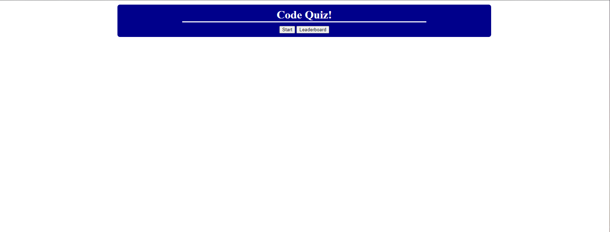
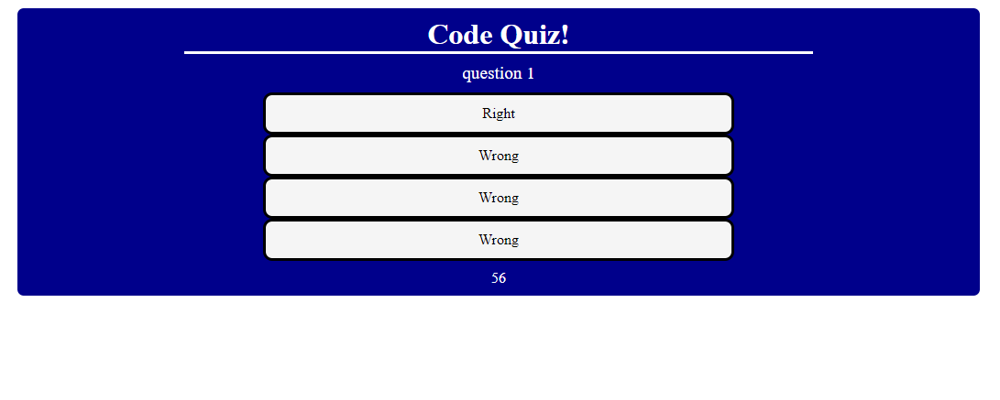
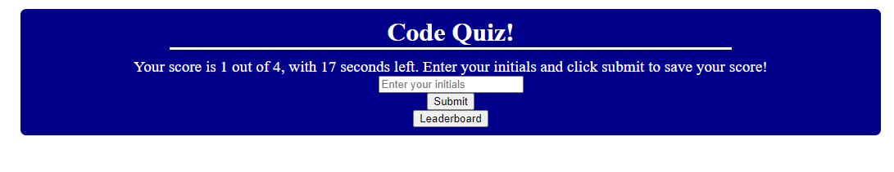
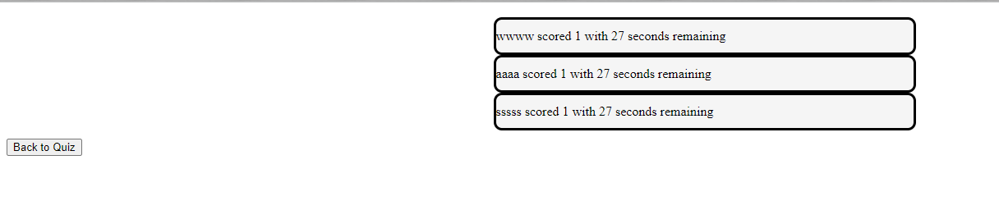

# challenge quiz ultimate

## Description
Project created for the Coders Bootcamp Pre-Work

Motivation to complete this project came from my knowledge extensively in quiz taking and understanding since I am fresh out of highschool. I wanted to make a simple quiz interface that could easily be modularly plugged into other websites and changed to fit any quiz in any format.

## Installation

N/A

## Usage

Take the quiz, save your results, and check the leaderboard! It logs everything no matter if you reload or close the page

## Credits

My classmates helped me a lot on this assignment and I gained heavy inspiration when starting getting my fundamental structure down from them. I cannot thank Annie enough for helping me get my local storage up and running because I had the most trouble with that. Turning that into a function really was the only thing I needed hand holding on.

## Tests

Open the page, and change the size of the screen to anything. It should be responsive and still look presentable and clean

Take the quiz multiple times and try to break the system. You cannot.

## Images

